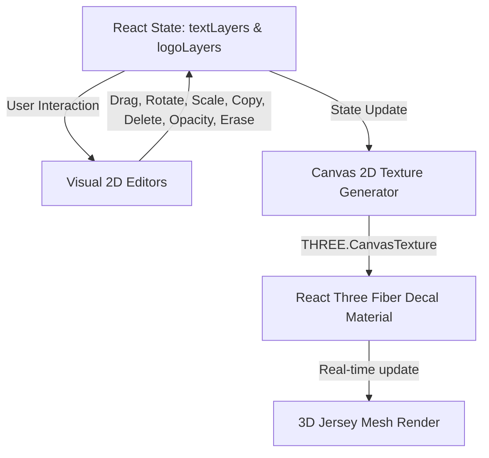

# Implementation Summary: 3D Jersey Customization System

This document details the architecture and implementation of the real-time dynamic text and logo customization systems, featuring unified visual interactive bounding box wrappers, layout persistence fixes, opacity controls, and border-free texture mapping with a dynamic Background Eraser.

---

## 1. Core Architecture Overview

We replaced the static inputs with a unified, **layer-based dynamic rendering system** for both text and logos. This system is backed by React state, synced in real-time to front/back 2D HTML5 canvas textures, and projected directly onto the 3D jersey model mesh as decals.

---

## 2. Key Components & Features Implemented

### A. Unified Text & Logo Layer States
Both systems use structured states mapped to a 1024×1024 texture canvas:
* **id**: Unique identifier (e.g. system layers `"front-text"`, `"front-number"` or custom/logo layers).
* **src / text**: Content representation (Base64 data URL/SVG path for logos; string value for text).
* **x, y**: Coordinates on the 1024×1024 texture canvas.
* **scale**: Floating-point scale factor.
* **rotation**: Angle of rotation in degrees (0–360).
* **side**: Target side (`"Front"` or `"Back"`).
* **opacity**: Transparency value (0.0 to 1.0) for logos, allowing seamless blending with underlying patterns.
* **eraserPaths**: Array of custom draw/erasure stroke coordinates `{ points: Array<{ x: number, y: number }>, size: number }` stored in the logo local coordinate space, ensuring erasures scale, translate, and rotate alongside the logo artwork.

### B. Interactive Transform Wrapper UI (Visual Editor)
We implemented two identical 280x280px visual editors (Text tab and Logos tab) with glassmorphism styling:
* **Dotted Bounding Box**: Surrounds the selected layer (hidden when in Eraser Mode).
* **Top-Left Handle (Duplicate)**: Clones the layer with a slight coordinate offset.
* **Top-Right Handle (Rotate)**: Drag to rotate the layer relative to its center.
* **Bottom-Left Handle (Delete)**: Removes the layer.
* **Bottom-Right Handle (Scale/Resize)**: Drag away or towards the center to scale dynamically.
* **Main Body Drag**: Allows dragging the layer across the entire jersey body (front, back, sleeves, etc.) without boundaries.

### C. Segmented Front/Back Switcher & Presets
* Front/Back view switcher toggles both 3D camera angles and 2D canvas editors.
* Added quick-preset buttons (Left Chest, Center, Right Chest, Back Top, Back Center, Sleeve) which snap layers to precise canvas coordinates, auto-toggling the active view if the position is on the opposite side.

### D. Image/Logo Opacity (Transparency) Control
* **Opacity Range Slider**: A new range slider goes from 0% (Fully Transparent) to 100% (Fully Opaque).
* **2D Canvas Sync**: Applies `globalAlpha` to the HTML5 canvas context before drawing each logo.
* **HTML Element Preview Sync**: Applies the inline CSS `opacity` style directly to the active 2D visual editor elements.

### E. Dynamic Background Eraser System
* **Eraser Toggle Button**: Positioned in the Logos customization sidebar right **above the Upload Custom Logo container**. Active only when a logo layer is selected.
* **Brush Size Control**: A range slider (2px to 100px) appears dynamically when Eraser Mode is active to control the brush width.
* **Destination-Out Composite Operation**:
  - Draws eraser stroke coordinates onto a temporary offscreen canvas using `ctx.globalCompositeOperation = 'destination-out'` to make pixels 100% transparent.
  - Syncs the erased canvas outputs directly to both the **2D Visual Editor** and the **3D Decal Texture** in real-time.
  - Automatically disables bounding box handles and logo dragging while active, letting the user paint directly onto the image bounds using a custom SVG eraser icon cursor.

### F. Uncapped Logo Sizing & Scaling
* **Bypassed Drag Constraints**: Removed the hardcoded maximum scale limit (`5.0`) in `handleLogoScaleStart`, allowing users to scale images to infinitely large sizes (min: `0.01`).
* **Expanded Slider Range**: Uncapped the selected logo scale slider maximum threshold from `5.0` to `20.0` (min: `0.01`), allowing for micro-sizing and large zooming via the sidebar.
* **Off-Canvas Rendering Support**: Confirmed that HTML5 Canvas 2D draws offscreen bounds natively, allowing logo graphics to bleed off the 2D workspace editor coordinates while maintaining seamless texture projections onto the 3D jersey model.

---

## 3. Bug Fixes & Rendering Enhancements

We identified and resolved three critical rendering and layering issues in the 3D customizer decals:

### Bug 1: Text & Logos Z-Index/Layering Issue on Pattern Change
* **Problem**: Selecting a pattern loaded a new pattern decal which co-planarly overlapped text and logos, rendering them underneath the pattern.
* **Fix**: Assigned explicit `renderOrder` sorting keys to the R3F `<Decal>` components. The pattern decals are assigned `renderOrder={1}`, while text, number, and logo decals are painted on front/back canvases at `renderOrder={10}`, guaranteeing they draw on top of patterns.

### Bug 2: Customization Disappearing on New Design Selection
* **Problem**: Selecting a layout design (like "Victory") rendering a solid background design decal covered customization layers completely because they were co-planar and drawn out of order.
* **Fix**: React states (`textLayers` and `logoLayers`) are fully preserved and persist during design selections. The `renderOrder={10}` on canvas decals and `renderOrder={1}` on design/pattern decals ensures that the customization layer is always drawn on top of the base design pattern.

### Bug 3: Thin Rectangular Border Outline Around Uploaded Images
* **Problem**: Uploaded images with solid backgrounds (such as a white background on a white jersey) displayed an unwanted thin grey/black rectangular border line on the 3D mesh due to Three.js texture mipmapping, wrapping, and canvas subpixel smoothing.
* **Fix**:
  1. **Disable Canvas Object Stroke**: Set `ctx.strokeStyle = "transparent"`, `ctx.lineWidth = 0`, and `ctx.shadowBlur = 0` during 2D canvas rendering to ensure zero border or stroke path residue.
  2. **Image Smoothing Fix**: Enabled high-quality image smoothing (`ctx.imageSmoothingEnabled = true`, `ctx.imageSmoothingQuality = "high"`) to eliminate pixel edges.
  3. **Canvas Texture Clamping & Filter Settings**: Configured the exported `THREE.CanvasTexture` with `wrapS = ClampToEdgeWrapping`, `wrapT = ClampToEdgeWrapping`, `generateMipmaps = false`, and `minFilter`/`magFilter` set to `THREE.LinearFilter`. This prevents texture mapping sample bleed at the boundaries of the Projected Decal, removing any visible edge lines.

---

## 4. How to Verify
1. Run the local dev server: `npm run dev`
2. Select the **Logos** tab in the customizer sidebar.
3. Click a Preset Badge or upload a custom logo.
4. Locate the **Background Eraser** panel directly **above the Upload Custom Logo dashed container**.
5. Toggle **Erase Pixels** to start erasing, select a brush size, and drag your cursor/finger on the canvas editor area to erase.
6. Toggle **Lock Drawing** to lock your edits and restore the normal bounding box controls (drag, scale, rotate).
