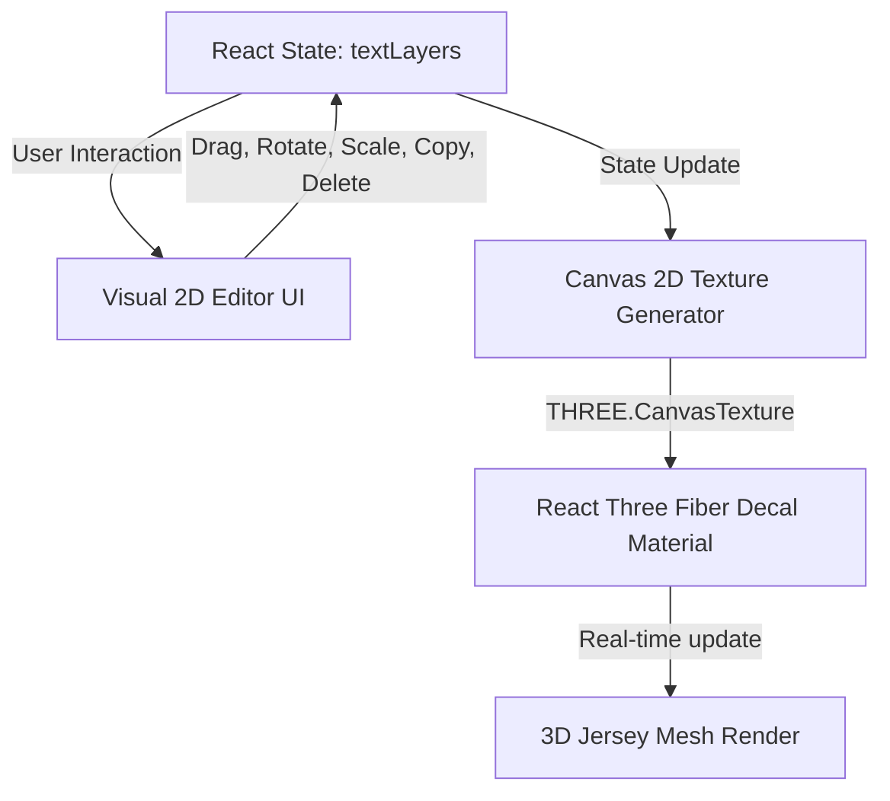

# Implementation Summary: 3D Jersey Dynamic Text Customization System

This document details the architecture and implementation of the real-time dynamic text customization system with a visual interactive bounding box wrapper UI.

---

## 1. Core Architecture Overview

We replaced the static, separate front/back input fields with a unified, **layer-based dynamic text rendering canvas**. This system is backed by React state, synced in real-time to a 2D HTML5 canvas, and mapped directly onto the 3D jersey model mesh as a 3D decal texture.

---

## 2. Key Components & Features Implemented

### A. Layer-Based Customizer State (`textLayers`)
We defined a structured state model for each individual text layer:
* **id**: Unique identifier (e.g. system layers `"front-text"`, `"front-number"` or custom layers).
* **text**: Custom string value.
* **x, y**: Coordinates on the 1024×1024 texture canvas.
* **scale**: Floating-point scale modifier.
* **rotation**: Angle of rotation in degrees (0–360).
* **font**: Active font style (e.g. `Varsity`, `Bold`, `Script`, `Outline`).
* **color**: HEX color code.
* **side**: Target side (`"Front"` or `"Back"`).

### B. Interactive Transform Wrapper UI (Visual Editor)
We implemented a 280x280px visual editor area styled with glassmorphism inside the sidebar panel:
* **Dotted Bounding Box**: Surrounds the active text layer when selected.
* **Top-Left Handle (Duplicate)**: Clones the layer with a slight coordinate offset.
* **Top-Right Handle (Rotate)**: Drag to rotate the text relative to its center coordinates.
* **Bottom-Left Handle (Delete)**: Removes the text layer.
* **Bottom-Right Handle (Scale/Resize)**: Drag away or towards the center to scale the text size up and down.
* **Main Body Drag**: Allows picking up and dragging the text layer anywhere within the customization boundaries.

### C. Segmented Front/Back Side Switcher
* Added an intuitive tab switcher at the top of the Text tab settings panel.
* This allows users to easily toggle active editing focus between the **Front Side** and **Back Side** of the jersey.
* Changing this switcher automatically turns the 3D view to match, filters the 2D customizer backdrop view, and loads the corresponding side's text layers list.

---

## 3. Bug Fixes (Layering & Persistence Stack)

We identified and resolved two critical rendering bugs in the 3D customizer decals:

### Bug 1: Text Z-Index/Layering Issue on Pattern Change
* **Problem**: Selecting a pattern loaded a new pattern decal which co-planarly overlapped the text decals, causing the text to render underneath the pattern.
* **Fix**: Added explicit `renderOrder` sorting keys to the R3F `<Decal>` components. The pattern decals are assigned `renderOrder={1}`, while text and number decals are assigned `renderOrder={10}`. This guarantees Three.js draws the text layers on top of patterns.

### Bug 2: Text Disappearing on New Design Selection
* **Problem**: Selecting a layout design (like "Victory") rendering a solid background design decal covered the text decal layer completely because they were co-planar and drawn out of order.
* **Fix**: The text state (`textLayers`) is fully preserved and persists during design selections. The `renderOrder={10}` on text decals and `renderOrder={1}` on design/pattern decals ensures that the text layer is always drawn on top of the base design pattern.

---

## 4. How to Verify or Extend

1. Run the local dev server: `npm run dev`
2. Select the **Text** tab in the customizer sidebar.
3. Switch between **Front Side** and **Back Side** using the segmented tab switcher to verify side switching.
4. Apply different Designs (e.g. "Victory") or Patterns (e.g. "Pattern 5") and verify that text layers are fully preserved, do not disappear, and render correctly on top of patterns.
